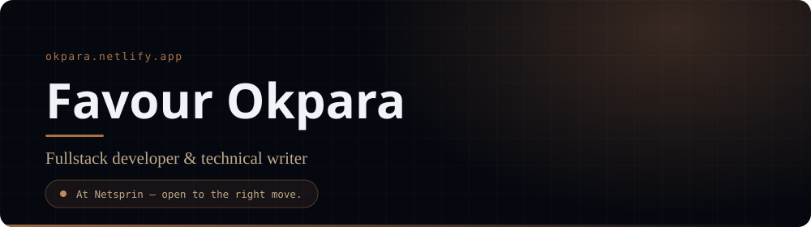
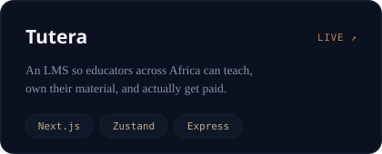
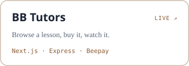
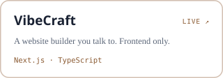
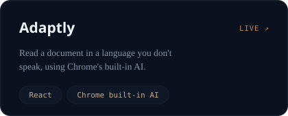
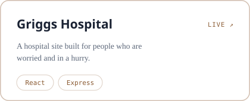

<!--
  GitHub profile README for @Okpara202
  Lives in the repo github.com/Okpara202/Okpara202 — the name must match the
  username exactly, or GitHub will not surface it on the profile.

  Voice and section names follow okpara.netlify.app rather than inventing new
  ones. Brown #AB7249 is the through-line, from the same site.

  The hero, the section headers and the project cards are hand-built SVG in
  assets/ rather than badge-service images. GitHub strips CSS from READMEs, so
  an SVG we own is the only place a real card system can live.

  Two rules those files follow, both learned the hard way:
    1. No page-coloured fills. A card filled with the site's near-black reads as
       a hole punched through GitHub's light theme. The cards are transparent
       with a brown border, so the page shows through either way.
    2. Nothing is a fixed page colour. Text defaults to the light theme and
       swaps under prefers-color-scheme, with the light values repeated as
       presentation attributes for anything that ignores the stylesheet.
       That query reads the OS theme, not GitHub's own setting, so a reader
       with GitHub dark on a light OS still gets the light text — but because
       of rule 1 that only costs some contrast, it cannot go invisible.
       The hero is exempt: it carries its own brown ground and its own light
       text, so it needs no query at all.
  Editing one means editing its SVG — that is the cost of it not looking generic.
-->

<!-- One link, not two: the CV lives on the portfolio and is only updated there. -->

---

<!--
  Section headings stay real <h3> elements with the SVG inline, so the document
  outline and the alt text survive.
-->
### 

I studied the human body for four years, then pointed the same question at software: *what is this part for, and what breaks if it stops?*

- Frontend Engineer at **Netsprin**, freelance frontend at **Simbi**. Enugu, Nigeria — WAT, UTC+1.
- I taught it before I claimed it: a 12-week React Native curriculum at Loctech, 50+ students through fullstack at LanceySoft.
- Open to frontend and fullstack roles, select freelance builds, and paid technical writing.

---

### 

<!--
  Cards sit loose in a centred div rather than a table: a table would lock the
  column count, this wraps to one-up on a narrow viewport by itself. Percentage
  widths, not fixed pixels — a fixed 420 overflowed the column at higher zoom
  and dropped every card onto its own row.
-->

Live links where there are live links. The client builds live in their organisations' repos; [VibeCraft](https://github.com/Okpara202/VibeCraft) and [Adaptly](https://github.com/Mmeso1/Adaptly) are mine to hand you.

---

### 

Neither is finished. That's rather the point of listing them.

- **Ahia** — a marketplace with the hard parts left in: real-time chat, escrow, and a notification pipeline that doesn't drop things. → [backend](https://github.com/Okpara202/Ahia-backend) · [storefront](https://github.com/Okpara202/Ahia) · [admin](https://github.com/Okpara202/ahia-admn)
- **MyCompound** — rent tracking for landlords who currently do it in a notebook. Still on paper; the repo goes public with the first working slice.

---

### 

React and Next are home. Express, Nest and Postgres are where I go when the interface needs something real to talk to, and React Native with Expo when it has to ship to a phone.

TypeScript · Redux Toolkit · Zustand · Tailwind · MongoDB · Redis · EAS Build

<!--
  github-profile-summary-cards, NOT github-readme-stats — that public instance
  is chronically rate-limited and is why so many profiles show a broken "Stats"
  image. The activity graph below it renders broken while its own service is
  having a moment — it comes back on its own, so leave it be.

  Deliberately dark in both colour schemes. A <picture> + prefers-color-scheme
  swap was tried and reverted: that media query reads the OS theme, not the one
  chosen in GitHub's settings, so a dark-mode GitHub reader on a light OS got
  white cards on a dark page.
-->

---

### 

For the developer who is stuck on it right now, not for the algorithm.

- [**Understanding React's Rendering Behavior**](https://medium.com/@okparafavour202/understanding-reacts-rendering-behavior-what-actually-triggers-a-re-render-01ee19399d4f) — the four things that genuinely trigger a re-render, and the ones everyone blames that don't.
- [**Tree Shaking Isn't Magic**](https://medium.com/@okparafavour202/tree-shaking-isnt-magic-common-mistakes-that-keep-your-bundle-bloated-86a706669cd9) — six habits that quietly keep dead code in the bundle you thought you'd trimmed.
- [**HTML Semantics**](https://medium.com/@okparafavour202/html-semantics-elevate-your-web-development-with-meaningful-markup-235c82f4dfea) — markup that tells a screen reader, and a crawler, what it is actually looking at.

[Everything else on Medium →](https://medium.com/@okparafavour202)

---

Frontend and fullstack roles, freelance builds, or a technical writing brief. I read everything and I answer.

  

<i>Still the same habit — take it apart, see what each piece was doing there.</i>

